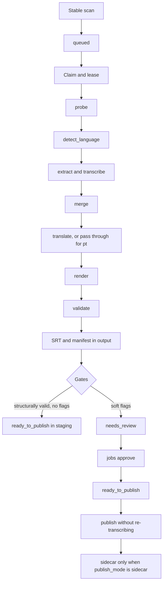

# Architecture

## Shape of the system

One process, `nas-subs`. The worker does both the periodic scan and the job
processing; there is no second scanner daemon. One job runs at a time,
guarded by a `flock` on `state_dir` (exit code 6 when it is already held) and
by a `BEGIN IMMEDIATE` claim in SQLite so two processes can never lease the
same job. Inference never holds the database lock. A heartbeat thread writes
every 30 s so a slow job is distinguishable from a dead worker.

## Modules

| Module | Responsibility |
|---|---|
| `domain.py` | Shared contract: protocols, enums, value objects, exit codes |
| `config.py` | YAML schema, validation, `pipeline_config_hash`, `stage_config_hash` |
| `cli.py` | Typer commands, `--json`, exit code translation |
| `logging_setup.py` | JSON logs on stdout with redaction |
| `health.py` | Heartbeat and database check for the container healthcheck |
| `discovery.py` | Walking roots, stability, fingerprints, existing subtitles |
| `media.py` | ffprobe inspection, stream selection, chunked extraction |
| `language.py` | Language tag normalisation and the source-language decision |
| `models.py` | Model bootstrap, verification and the model manifest |
| `transcription.py` | faster-whisper, per-chunk checkpoints, the global merge |
| `translation.py` | Argos, stable translation units, the SQLite cache |
| `segmentation.py` | Grouping translated units into cues, line wrapping |
| `quality.py` | Structural and advisory gates |
| `output.py` | SRT rendering, staging layout, exclusive publication |
| `repository.py` | SQLite queue, artifacts, events, caches |
| `states.py` | The only place job state transitions are allowed |
| `worker.py` | Scan loop, claim, heartbeat, SIGTERM, cleanup, backup |
| `pipeline.py` | Stage orchestration with checkpoint reuse |

The engines sit behind `Protocol`s in `domain.py`: `MediaProbe`,
`AudioExtractor`, `Transcriber`, `Translator`, `SubtitleRenderer` and
`JobRepository`. Tests inject fakes. Replacing the translator does not
require touching the queue or the output code. There is deliberately no
generic plugin system.

## Time and chunk ownership

Every timestamp in the system is absolute on the video timeline. Audio
streams can have a non-zero `start_time`, and chunks are extracted from the
middle of a file, so both offsets are added back before anything is stored.

Chunk `k` **owns** `[k * chunk_seconds, min((k+1) * chunk_seconds,
duration))`. Extraction is wider by `overlap_seconds` on each side to give
the decoder context, but a word is only kept by the chunk whose owned
interval contains the word's **midpoint**. Ownership is half-open, so a
timestamp exactly on a boundary belongs to exactly one chunk. Words are put
in global order before being grouped into cues, so a sentence spanning a
boundary becomes one cue rather than two.

Deduplication only removes equivalent tokens with overlapping intervals,
keeping the more confident copy. A phrase genuinely repeated at a different
time is left alone.

Silence produces zero cues. Suspicious output (long repetitions, text where
there is no speech, low confidence) produces flags, not deletions: the raw
scores and the thresholds used go into the manifest.

## State and recovery

States: `queued`, `running`, `retry_wait`, `needs_review`,
`ready_to_publish`, `completed`, `skipped`, `failed`, `cancelled`. Stages:
`probe`, `detect_language`, `extract`, `transcribe`, `merge`, `translate`,
`render`, `validate`, `publish`.

`completed` requires both a final subtitle and a valid manifest. A result
sitting in staging with review flags stays `needs_review` and is never
reopened automatically by the worker. `approve` only moves a job forward once
the structural errors are gone, and records a timestamp. Cancelling blocks
publication while keeping the checkpoints.

Transient I/O and subprocess faults get 3 retries at 300 s, 1800 s and
7200 s, then `failed`. Permission errors, a missing model or language,
invalid media and output conflicts are never retried. Two interruptions in
the same stage escalate to `needs_review`. SIGTERM kills the subprocesses,
abandons the incomplete checkpoint and returns the job for resumption; it is
not counted as a content failure.

Each chunk writes a versioned JSON checkpoint to a temporary file which is
flushed and renamed on the same filesystem. A checkpoint is only reused when
the job ID, fingerprint, schema version, stage config hash and model identity
all match, which is why `config.py` produces a separate hash per stage:
changing the subtitle width invalidates rendering without throwing away
hours of transcription.

## Publication

Staging is the default: the SRT and a JSON manifest are written under
`output_dir`, keeping the relative tree and prefixing it with the root ID so
two roots cannot collide.

Publishing writes a uniquely named temporary file **in the target
directory**, verifies and fsyncs it, then creates the final name with
`os.link`. `EEXIST` means someone else owns that name: that is an
`output_conflict` and both files are preserved. A filesystem without hard
links yields `unsupported_atomic_publish` rather than a `rename` that could
clobber. The fingerprint and any existing subtitle are re-checked
immediately before publishing. If the process dies between creating the file
and committing to the database, reconciliation compares checksums; divergent
content is a conflict.

Manifests stay in `state_dir` and staging. They are never written next to a
video.
